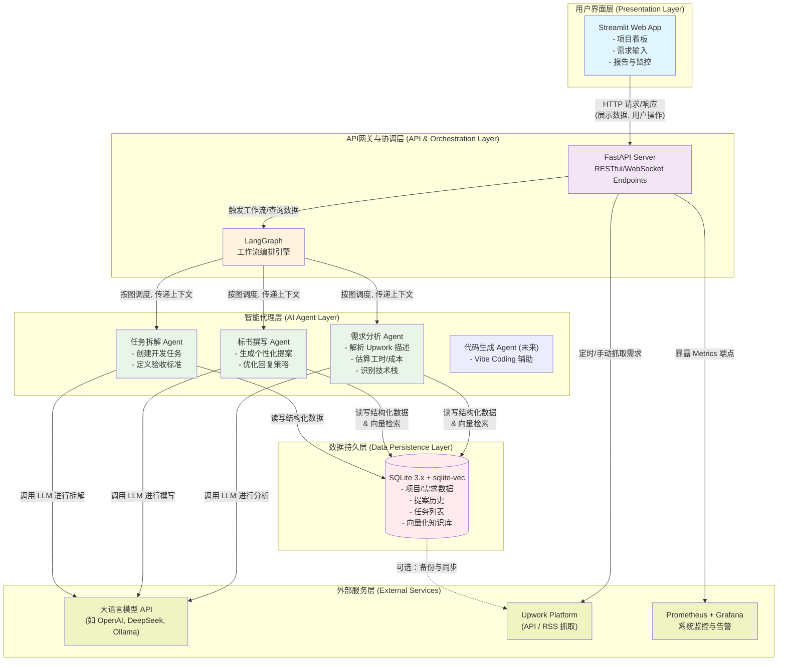

# NoMadNomad 项目文档

## 项目概述

### 1.1 项目背景
NoMadNomad 是一个专为技术型自由职业者设计的AI驱动全流程项目管理工具。该系统旨在自动化处理从Upwork平台投标到项目交付的完整工作流，将原本耗时的手动流程转化为高效的AI辅助工作流。

### 1.2 核心价值
- **效率提升**：将Upwork提案撰写时间从30分钟减少到5分钟以内
- **质量保证**：通过AI辅助确保技术方案的专业性和准确性
- **流程标准化**：建立可重复、可追踪的项目管理流程
- **学习实践**：作为敏捷开发、AI编程、现代软件工程实践的完整案例

### 1.3 目标用户
- 技术型自由职业者（初级到资深）
- 熟悉软件开发流程但希望优化管理效率的开发者
- 希望系统化记录和分享技术实践的技术博主

## 技术架构

### 2.1 技术栈选型

#### 核心框架
- **AI协调框架**：LangGraph - 基于图的多Agent确定性编排
- **AI开发框架**：LangChain - AI应用开发工具链
- **后端框架**：FastAPI 0.104+ - 异步Web框架
- **前端框架**：Streamlit 1.29+ - 数据应用快速开发
- **数据库**：SQLite 3.45+ + sqlite-vec扩展 - 轻量级本地存储

#### 开发运维
- **容器化**：Docker + Docker Compose
- **CI/CD**：GitLab CI（初期可用GitHub Actions）
- **监控**：Prometheus + Grafana
- **部署**：阿里云轻量应用服务器（2核4GB）

### 2.2 系统架构图



### 2.3 内存约束设计
系统设计遵循严格的2GB内存约束：

| 组件 | 内存分配 | 优化措施 |
|------|---------|---------|
| LangGraph Agent服务 | 1.0GB | Docker内存限制，状态清理 |
| FastAPI后端 | 256MB | 异步处理，连接池优化 |
| Streamlit前端 | 512MB | 数据缓存，分批加载 |
| SQLite数据库 | 128MB | 缓存大小限制，WAL模式 |
| 监控系统 | 700MB | 指标采样，数据保留策略 |
| 系统预留 | 256MB | - |
| **总计** | **~2.0GB** | - |

## 功能规格

### 3.1 核心功能模块

#### 3.1.1 需求分析Agent
- **输入**：Upwork任务描述文本
- **处理**：结构化解析技术栈、预算、时间线、关键需求
- **输出**：JSON格式分析报告
- **优先级**：P0

#### 3.1.2 提案生成Agent
- **输入**：需求分析结果 + 用户历史提案模板
- **处理**：生成专业投标提案，包括技术方案、时间估算、报价
- **输出**：格式化提案文档（Markdown/PDF）
- **优先级**：P0

#### 3.1.3 语言润色Agent
- **输入**：原始提案文本
- **处理**：语法校正、风格优化、语气调整
- **输出**：润色后的提案文本
- **特性**：学习用户写作习惯，保持个人风格
- **优先级**：P1

#### 3.1.4 技术架构Agent
- **输入**：项目需求分析
- **处理**：技术选型建议、架构设计、风险评估
- **输出**：技术架构文档、技术栈推荐
- **优先级**：P1

#### 3.1.5 任务拆解Agent
- **输入**：项目需求 + 技术架构
- **处理**：分解为用户故事卡、估算开发时间
- **输出**：故事卡列表、项目时间线
- **优先级**：P1

#### 3.1.6 项目管理模块
- **功能**：故事卡看板、进度跟踪、里程碑管理
- **集成**：支持导出到Trello/Jira等工具
- **优先级**：P2

### 3.2 用户界面

#### 3.2.1 主页仪表板
- 项目概览统计
- 近期活动时间线
- 快速操作入口

#### 3.2.2 需求分析界面
- Upwork描述粘贴区域
- 实时分析结果显示
- 分析结果编辑和调整

#### 3.2.3 提案管理界面
- 提案列表和状态
- 提案编辑和预览
- 版本历史对比

#### 3.2.4 项目管理界面
- 故事卡看板（Backlog/Ready/In Progress/Done）
- 甘特图时间线
- 资源分配视图

#### 3.2.5 设置界面
- API密钥配置
- 写作风格偏好设置
- 模板管理

## 数据模型

### 4.1 核心数据表设计

#### 4.1.1 项目表 (projects)
```sql
CREATE TABLE projects (
    id TEXT PRIMARY KEY,
    title TEXT NOT NULL,
    description TEXT,
    source_platform TEXT,  -- 'upwork', 'other'
    original_description TEXT,
    budget_range TEXT,
    timeline TEXT,
    status TEXT DEFAULT 'draft',  -- draft, analyzing, proposal, active, completed
    created_at TIMESTAMP DEFAULT CURRENT_TIMESTAMP,
    updated_at TIMESTAMP DEFAULT CURRENT_TIMESTAMP
);
```

#### 4.1.2 需求分析表 (requirement_analyses)
```sql
CREATE TABLE requirement_analyses (
    id TEXT PRIMARY KEY,
    project_id TEXT REFERENCES projects(id),
    raw_analysis JSONB,
    tech_stack JSONB,  -- 技术栈数组
    key_requirements JSONB,
    complexity_score INTEGER,
    risk_assessment TEXT,
    created_at TIMESTAMP DEFAULT CURRENT_TIMESTAMP
);

CREATE INDEX idx_requirement_analyses_project ON requirement_analyses(project_id);
```

#### 4.1.3 提案表 (proposals)
```sql
CREATE TABLE proposals (
    id TEXT PRIMARY KEY,
    project_id TEXT REFERENCES projects(id),
    version INTEGER DEFAULT 1,
    content_markdown TEXT,
    content_html TEXT,
    variables JSONB,  -- 模板变量
    status TEXT DEFAULT 'draft',  -- draft, polished, sent, accepted
    polished_content TEXT,
    created_at TIMESTAMP DEFAULT CURRENT_TIMESTAMP,
    updated_at TIMESTAMP DEFAULT CURRENT_TIMESTAMP
);

CREATE INDEX idx_proposals_project ON proposals(project_id);
CREATE INDEX idx_proposals_status ON proposals(status);
```

#### 4.1.4 故事卡表 (user_stories)
```sql
CREATE TABLE user_stories (
    id TEXT PRIMARY KEY,
    project_id TEXT REFERENCES projects(id),
    title TEXT NOT NULL,
    description TEXT,
    acceptance_criteria JSONB,
    estimate_hours INTEGER,
    priority INTEGER DEFAULT 3,  -- 1: P0, 2: P1, 3: P2
    status TEXT DEFAULT 'backlog',  -- backlog, ready, in_progress, done
    assigned_to TEXT,
    started_at TIMESTAMP,
    completed_at TIMESTAMP,
    created_at TIMESTAMP DEFAULT CURRENT_TIMESTAMP
);

CREATE INDEX idx_user_stories_project ON user_stories(project_id);
CREATE INDEX idx_user_stories_status ON user_stories(status);
CREATE INDEX idx_user_stories_priority ON user_stories(priority);
```

#### 4.1.5 Agent运行记录表 (agent_runs)
```sql
CREATE TABLE agent_runs (
    id TEXT PRIMARY KEY,
    agent_type TEXT NOT NULL,  -- 'requirement_analyzer', 'proposal_generator', etc.
    project_id TEXT REFERENCES projects(id),
    input_data JSONB,
    output_data JSONB,
    intermediate_steps JSONB,
    model_used TEXT,
    prompt_version TEXT,
    duration_ms INTEGER,
    success BOOLEAN,
    error_message TEXT,
    created_at TIMESTAMP DEFAULT CURRENT_TIMESTAMP
);

CREATE INDEX idx_agent_runs_agent_type ON agent_runs(agent_type);
CREATE INDEX idx_agent_runs_project ON agent_runs(project_id);
CREATE INDEX idx_agent_runs_created ON agent_runs(created_at);
```

#### 4.1.6 向量存储表 (使用sqlite-vec扩展)
```sql
-- 安装sqlite-vec扩展后
CREATE VIRTUAL TABLE document_embeddings USING vec0(
    model_id TEXT,  -- 使用的嵌入模型
    chunk_id TEXT PRIMARY KEY,
    content TEXT,
    metadata JSONB,
    embedding BLOB  -- 向量数据
);

-- 创建向量索引
CREATE INDEX idx_document_embeddings_model ON document_embeddings(model_id);
```

### 4.2 数据关系图
```
projects
    ├── requirement_analyses (1:1)
    ├── proposals (1:N)
    ├── user_stories (1:N)
    └── agent_runs (1:N)
```

## 开发流程

### 5.1 敏捷开发实践

#### 5.1.1 迭代周期
- **迭代长度**：2周一个Sprint
- **每日站会**：虚拟站会，记录开发进展
- **迭代计划**：每Sprint开始前规划用户故事卡
- **迭代回顾**：每Sprint结束后总结经验教训

#### 5.1.2 用户故事卡模板
```markdown
## 故事卡: [ID] 功能描述

**作为** [角色]
**我希望** [功能]
**以便** [价值]

### 验收标准:
- [ ] 标准1
- [ ] 标准2

### 技术任务:
- [ ] 任务1
- [ ] 任务2

### 估算时间: X小时
### 优先级: P0/P1/P2
```

#### 5.1.3 看板管理
- **工具**：GitHub Projects 或 Linear.app
- **列定义**：Backlog → Ready → In Progress → Review → Done
- **WIP限制**：In Progress列最多3个任务

### 5.2 测试策略

#### 5.2.1 测试金字塔
- **单元测试** (70%)：pytest，覆盖率>90%
- **集成测试** (20%)：Agent间交互，数据库操作
- **端到端测试** (10%)：完整用户流程测试

#### 5.2.2 TDD工作流
1. **红**：编写失败的测试
2. **绿**：实现最小代码通过测试
3. **重构**：优化代码结构，保持测试通过

#### 5.2.3 AI测试策略
- **确定性测试**：固定输入验证输出格式
- **语义测试**：验证输出含义而非精确文本
- **边界测试**：测试极端和异常输入

### 5.3 代码质量

#### 5.3.1 代码规范
- **格式化**：black + isort
- **类型检查**：mypy (strict模式)
- **代码审查**：pre-commit hooks + AI辅助审查

#### 5.3.2 Git工作流
- **分支策略**：main分支保护，feature分支开发
- **提交规范**：Conventional Commits
- **代码审查**：所有更改需通过PR合并

## 部署与运维

### 6.1 本地开发环境

#### 6.1.1 环境要求
- Python 3.11+
- Docker Desktop
- 内存：8GB+ (开发环境)
- 存储：10GB+ 可用空间

#### 6.1.2 本地启动流程
```bash
# 1. 克隆项目
git clone https://github.com/yourusername/NoMadNomad.git
cd NoMadNomad

# 2. 启动服务
docker-compose up -d

# 3. 访问应用
# 前端：http://localhost:8501
# 后端API：http://localhost:8000
# API文档：http://localhost:8000/docs
```

#### 6.1.3 开发工作流
```bash
# 创建虚拟环境
python -m venv .venv
source .venv/bin/activate  # Linux/Mac
# 或 .venv\Scripts\activate (Windows)

# 安装依赖
pip install -r requirements/dev.txt

# 运行测试
pytest --cov=src --cov-report=html

# 代码检查
black src tests
isort src tests
mypy src
```

### 6.2 生产部署

#### 6.2.1 部署目标
- **初级**：阿里云轻量应用服务器 (2核4GB，年付199元)
- **备选**：Railway.app 或 Fly.io (国际部署)
- **成本控制**：月预算<$50 (包含AI API调用)

#### 6.2.2 生产配置
```yaml
# docker-compose.prod.yml
version: '3.8'

services:
  backend:
    build: ./backend
    ports:
      - "8000:8000"
    environment:
      - DATABASE_URL=sqlite:////data/nomadnomad.db
      - OPENAI_API_KEY=${OPENAI_API_KEY}
      - ENVIRONMENT=production
    volumes:
      - /data:/data
    restart: unless-stopped
    deploy:
      resources:
        limits:
          memory: 256M
          cpus: '0.5'
  
  frontend:
    build: ./frontend
    ports:
      - "8501:8501"
    environment:
      - BACKEND_URL=http://backend:8000
    restart: unless-stopped
    deploy:
      resources:
        limits:
          memory: 512M
          cpus: '0.5'
```

#### 6.2.3 备份策略
```bash
#!/bin/bash
# /scripts/backup.sh
BACKUP_DIR="/backups"
DB_FILE="/data/nomadnomad.db"
DATE=$(date +%Y%m%d_%H%M%S)

# 1. 停止服务写入
docker-compose -f docker-compose.prod.yml stop backend

# 2. 备份数据库
sqlite3 "$DB_FILE" ".backup '$BACKUP_DIR/backup_$DATE.db'"

# 3. 重启服务
docker-compose -f docker-compose.prod.yml start backend

# 4. 压缩备份
gzip "$BACKUP_DIR/backup_$DATE.db"

# 5. 上传到云存储 (可选)
# rclone copy "$BACKUP_DIR/backup_$DATE.db.gz" backup:nomadnomad/

# 6. 清理旧备份 (保留最近30天)
find "$BACKUP_DIR" -name "*.db.gz" -mtime +30 -delete
```

### 6.3 监控与告警

#### 6.3.1 监控指标
- **应用指标**：请求数、响应时间、错误率
- **AI指标**：API调用次数、token使用量、成本
- **系统指标**：CPU、内存、磁盘使用率
- **业务指标**：提案生成数、项目完成率

#### 6.3.2 Grafana仪表板
- **应用健康视图**：服务状态、响应时间
- **AI使用视图**：API调用统计、成本分析
- **业务分析视图**：项目统计、效率指标

#### 6.3.3 告警规则
```yaml
# monitoring/prometheus/alerts.yml
groups:
  - name: nomadnomad_alerts
    rules:
      - alert: HighErrorRate
        expr: rate(http_requests_total{status=~"5.."}[5m]) > 0.1
        for: 2m
        labels:
          severity: warning
        annotations:
          summary: "高错误率检测"
          description: "错误率超过10%"
      
      - alert: HighMemoryUsage
        expr: container_memory_usage_bytes{container="backend"} > 200 * 1024 * 1024
        for: 5m
        labels:
          severity: warning
        annotations:
          summary: "后端内存使用过高"
          description: "内存使用超过200MB"
```

## 项目路线图

### 7.1 阶段1：MVP (4-6周)

#### 目标
验证核心工作流，建立基础框架

#### 交付物
1. **基础框架**：FastAPI + Streamlit + SQLite集成
2. **核心Agent**：需求分析Agent + 提案生成Agent
3. **基础界面**：需求分析页面 + 提案管理页面
4. **开发流程**：TDD环境 + CI/CD流水线

#### 成功标准
- Upwork需求分析准确率>80%
- 提案生成5分钟
- 系统内存2GB
- 代码测试覆盖率>90%

### 7.2 阶段2：功能增强 (6-8周)

#### 目标
完善核心功能，提升用户体验

#### 交付物
1. **增强Agent**：语言润色Agent + 任务拆解Agent
2. **管理功能**：项目管理看板 + 进度跟踪
3. **用户界面**：完整的工作流界面
4. **监控系统**：基础监控 + 告警

#### 成功标准
- 用户满意度评分>4.5/5
- 每周主动使用次数>10次
- 系统可用性>99.5%
- 关键路径自动化程度>80%

### 7.3 阶段3：生产就绪 (4-6周)

#### 目标
系统优化，生产部署

#### 交付物
1. **性能优化**：内存优化，响应时间优化
2. **安全加固**：认证授权，数据加密
3. **部署自动化**：一键部署脚本
4. **文档完善**：用户文档，API文档

#### 成功标准
- 生产环境稳定运行30天无故障
- 平均响应时间<1秒
- 数据备份恢复测试通过
- 完整的技术文档和用户指南

### 7.4 阶段4：扩展与分享 (持续)

#### 目标
功能扩展，知识分享

#### 计划
1. **功能扩展**：多平台支持，团队协作功能
2. **技术分享**：博客文章，开源项目
3. **社区建设**：用户反馈收集，功能迭代

## 风险与缓解

### 8.1 技术风险

#### 风险1：AI Agent输出不稳定性
- **描述**：LLM输出不可预测，影响系统可靠性
- **概率**：中
- **影响**：高
- **缓解措施**：
  1. 结构化Prompt设计，约束输出格式
  2. 输出验证层，检查格式和内容有效性
  3. 重试机制，失败时自动重试或降级处理
  4. 人工审核选项，关键输出需人工确认

#### 风险2：SQLite性能瓶颈
- **描述**：SQLite并发写入性能有限
- **概率**：中
- **影响**：中
- **缓解措施**：
  1. 读写连接分离，只读操作用只读连接
  2. 批量写入优化，减少事务提交次数
  3. 定期数据库维护，VACUUM和ANALYZE
  4. 性能监控，及时发现性能下降

#### 风险3：内存约束挑战
- **描述**：2GB内存限制可能影响功能实现
- **概率**：高
- **影响**：高
- **缓解措施**：
  1. 严格的内存监控和限制
  2. 数据分批处理，避免一次性加载大数据集
  3. 缓存策略优化，LRU缓存淘汰
  4. 资源使用分析，识别内存热点

### 8.2 项目风险

#### 风险1：开发时间不足
- **描述**：业余时间开发，进度可能延迟
- **概率**：高
- **影响**：中
- **缓解措施**：
  1. 最小可行产品(MVP)优先
  2. 功能优先级严格排序
  3. 时间跟踪，每周进度评估
  4. 灵活调整范围，确保核心功能

#### 风险2：技术学习曲线
- **描述**：新技术栈学习需要时间
- **概率**：高
- **影响**：中
- **缓解措施**：
  1. 渐进式学习，从简单功能开始
  2. 文档和笔记记录，积累知识库
  3. 社区资源利用，Stack Overflow等
  4. 实验性原型，快速验证技术可行性

### 8.3 运营风险

#### 风险1：AI API成本失控
- **描述**：AI API调用成本可能超出预算
- **概率**：中
- **影响**：中
- **缓解措施**：
  1. 成本监控和告警
  2. 缓存策略，减少重复调用
  3. 模型选择优化，简单任务用便宜模型
  4. 使用量配额，每日/每月限制

#### 风险2：数据安全风险
- **描述**：本地存储敏感项目数据
- **概率**：低
- **影响**：高
- **缓解措施**：
  1. 数据加密存储
  2. 定期备份和恢复测试
  3. 访问控制，API密钥管理
  4. 安全审计，定期检查安全配置

## 附录

### A.1 术语表

| 术语 | 定义 |
|------|------|
| Agent | 具有特定功能的AI代理，如需求分析Agent |
| LangGraph | 基于图的多Agent协调框架 |
| 故事卡 | 敏捷开发中的用户需求描述单元 |
| TDD | 测试驱动开发(Test-Driven Development) |
| CI/CD | 持续集成/持续部署 |
| MVP | 最小可行产品(Minimum Viable Product) |
| SQLite | 轻量级嵌入式数据库 |
| Streamlit | 基于Python的数据应用开发框架 |

### A.2 参考资源

#### 技术文档
- LangGraph官方文档：https://langchain-ai.github.io/langgraph/
- FastAPI文档：https://fastapi.tiangolo.com/
- Streamlit文档：https://docs.streamlit.io/
- SQLite文档：https://www.sqlite.org/docs.html
- sqlite-vec扩展：https://github.com/asg017/sqlite-vec

#### 开发工具
- Docker文档：https://docs.docker.com/
- GitLab CI/CD：https://docs.gitlab.com/ee/ci/
- Prometheus文档：https://prometheus.io/docs/
- Grafana文档：https://grafana.com/docs/

#### 学习资源
- 敏捷开发实践：https://agilemanifesto.org/
- TDD实践指南：https://tdd.tools/
- AI Agent设计模式：https://www.patterns.app/

### A.3 变更记录

| 版本 | 日期 | 修改内容 | 修改人 |
|------|------|---------|--------|
| 1.0 | 2026-03-11 | 初始版本创建 | 系统 |
| 1.1 | 2026-03-11 | 修正技术栈，采纳SQLite方案 | 系统 |

---

**文档状态**：草案  
**最后更新**：2026年3月11日  
**下一步**：开始阶段1 MVP开发